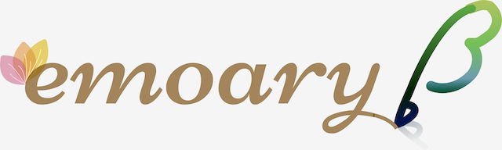

  

<h1 align="center">emoary — emotion + diary</h1>

  <em>Record feelings lightly. Reflect deeply when you want.</em>

  <a href="#-overview">Overview</a> •
  <a href="#-core-principles">Core principles</a> •
  <a href="#-features-mvp--beyond">Features</a> •
  <a href="#-screens--mockups">Screens / Mockups</a> •
  <a href="#-roadmap">Roadmap</a> •
  <a href="#-tech-stack-planned">Tech Stack</a> •
  <a href="#-run-locally">Run locally</a> •
  <a href="#-ethics--privacy">Ethics & Privacy</a>

---

## ✨ Overview
**emoary** is a well‑being web app that helps people **notice** their emotions and **look back** on patterns over time.
- **Fast entry**: pick an emotion and adjust a slider
- **Optional depth**: jot a short memo or (future) talk with a conversational AI to explore causes.
- **Gentle by design**: useful but never pushy; built around *continuity* and *self‑awareness*.

> This repository currently contains early design assets (requirements, mockups, logo/icon) and the first implementation steps.

## 🧭 Core principles
- **Easy to continue** — minimal input first; no cognitive overload.
- **Staged depth** — start light, go deeper only when helpful.
- **User autonomy** — keep interventions supportive, not intrusive.
- **Reflection matters** — turn logs into insights and small actions.

## 🧩 Features (MVP & beyond)
**MVP**
- Emotion selection + **intensity slider**
- **Quick note** (optional)
- **Timeline / simple trends** for reflection
- Account / auth (personal diary stays yours)

**Planned / Next**
- **Conversational AI counselor** (cause exploration, gentle prompts)
- “**Emotion tree**” that grows with journaling frequency
- Reminders, custom emotions, integrations (calendar / SNS)
- Multi‑language support

## 🖼 Screens / Mockups

  

- Mockups (PDF): [mockup_emoary.pdf](./docs/mockup_emoary.pdf)
- Requirements draft: [requirements_definition.md](./docs/requirements_definition.md)

## 🗺 Roadmap
- [ ] MVP: emotion + slider + quick note
- [ ] Basic reflection view (weekly/monthly)
- [ ] Auth & local persistence
- [ ] Conversational AI (prototype)
- [ ] Emotion tree visualization
- [ ] Reminder & small nudge experiments
- [ ] Usability testing & log-based tweaks

## 🧱 Tech Stack (planned)
> To be finalized as implementation progresses.
- Backend: Ruby on Rails 7 (API mode)
- Frontend: Hotwire (Turbo / Stimulus) or React (if SPA needed)
- Database: PostgreSQL
- Auth: Devise or similar (planned)
- Deployment: Render 

## Usage
You can try emoary here: [https://example.com](https://example.com)  ←Coming Soon!  
No installation is required — just open the link and start recording your emotions!

## Live Demo
Coming soon! The app is currently being prepared for deployment.  
Please check back later for the live URL.

## 🧪 Design notes
Through iterative builds, I am testing the balance between **user autonomy** and **app interventions** to support
**sustained engagement** without pressure. Small hypothesis → tweak UI copy/layout → observe → refine.

## 🛡 Ethics & Privacy
- Private by default; your diary is yours.
- Minimal collection; clear purpose and control.
- Supportive language; no shaming or coercive nudges.

---

  Built with curiosity and care — to make space for everyday feelings.

